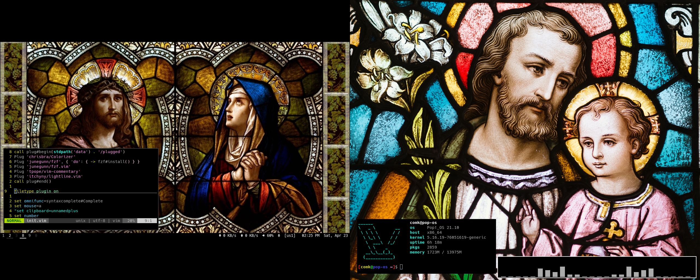

# dotfiles

My simple dot files ~stolen from the internet~

## Software

- Terminal: [st](https://github.com/markus-gabryel/st)
- Window manager: [dwm](https://github.com/markus-gabryel/dwm)
- Compositor: picom
- Shell: zsh
- Editor: neovim
- PrintScreen: flameshot
- Image viewer: sxiv
- File manager: fff
- Launcher: [dmenu](https://tools.suckless.org/dmenu)

