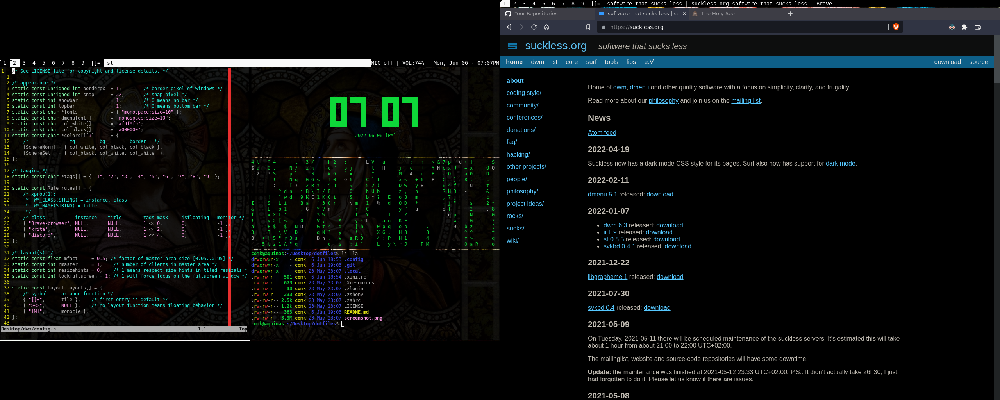

# dotfiles

My simple dot files ~~stolen from the internet~~

## Software

- Terminal: st (Luke Smith)
- Window manager: bspwm
- Hotkey daemon: sxhkd
- Compositor: picom
- Bar: Polybar
- Shell: Zsh
- Editor: Neovim
- Image viewer: sxiv
- File manager: fff
- Launcher: dmenu (my fork)

